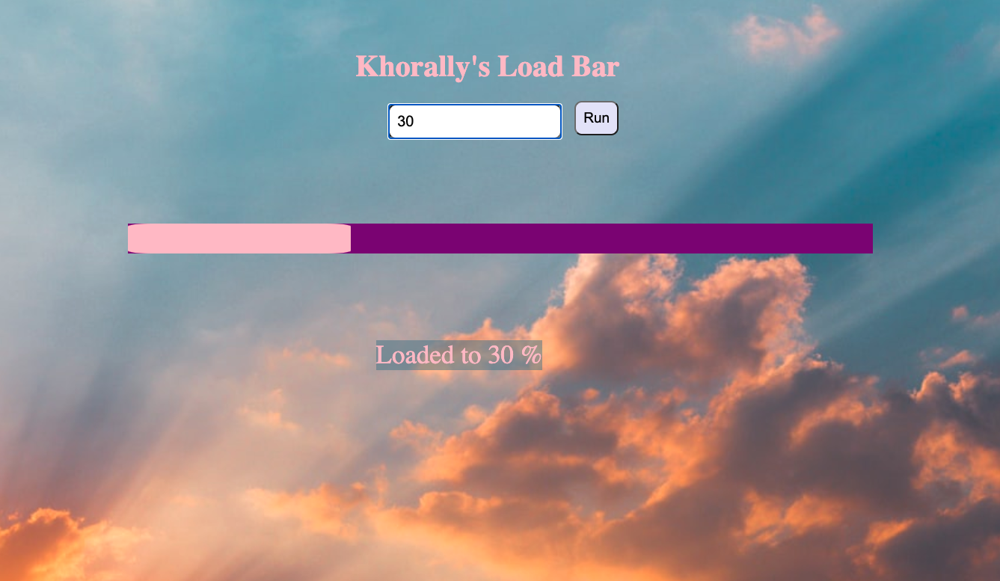

# Khorally-s-Load-Bar

Welcome to my load bar app! Here, users can add a number, press 'enter', and the bar will load to that parcentage. If you'd like to load to 100%, click 'run' Check out the deployed version on Netlify [here](https://competent-bhaskara-1136e6.netlify.app/).

# How It's Made:
Tech used: HTML, CSS and JavaScript. I especially enjoyed making my code as dry as possible.

Examples:
Take a look at these couple examples that I have in my own portfolio:

https://wonderful-easley-4bdc4b.netlify.app/

https://hopeful-hamilton-96af68.netlify.app/

https://zealous-dubinsky-e78c32.netlify.app
